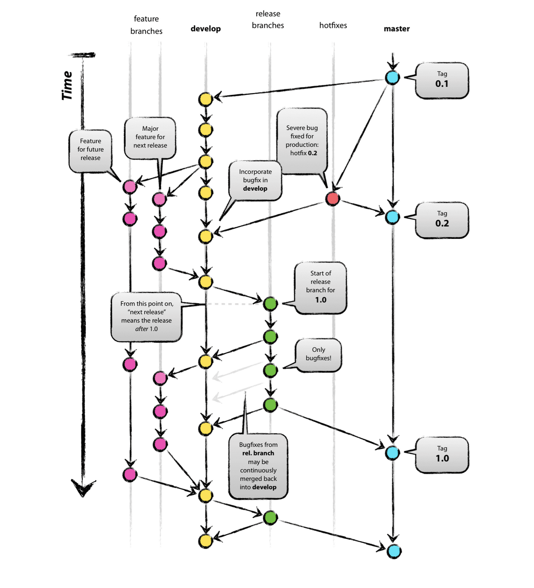

# Bridge Web App

## Projects

- [client](./client): Next.js based client
- [api](./api): Express based api server
- [tasks](./tasks): general task runner for things like linting and deploying other projects

## Branches

- [develop](./dev): Branch we branch off of and into for development. We run this branch locally. 
- [test](./test): Code to be run and pushed to live test server that should mimic production (used for QA). `VARIABLE_ENV=test`
- [master](./master): Code to be tagged with a version and pushed to live production server. `VARIABLE_ENV=production`

## Gitflow

Our development process uses the diagram below and is explained underneath (branch names are in **bold**).



### Phase 1: Development
1. Pick up a feature, and branch off of **develop**, naming your branch after the feature.
   - prefix branch name with what type of effort is being done. Options: `feature/`, `fix/`, `chore/`
   - put the issue number after the effort type e.g. `feature/5432/`
   - include a short (less than 3-5) word description of the issue after the issue number e.g. `feature/5432/add_the_thing`
   - examples: `feature/77/add_description_field`, `fix/78/handle_missing_description_text`, `chore/42/api_dockerfile` 
2. Once the feature is developed, open a PR against **develop**
3. After the PR is approved, it will be merged into **develop**

### Phase 2: QA
1. Once all of the features planned for a release are merged into **develop**, we merge **develop** into **test**
2. Our Ci/CD (CircleCi) will pick up the merge event on a supported branch, **test** and queue a build to push the updated branch to its live environment.
3. The live **test** environment will then be QA'd, and any bug fixes that need to happen can be made in the original feature branch, then merged into **develop** which will again merge into **test**.

### Phase 3: Delivery
Once your feature branch is qa approved, it will me merged into **master** from **test** along with the rest of the features in **test** that are qa-passed.
The merge will trigger a build task via CircleCi to deploy everything in master to our production environment.


## Development with Docker
See the top-level [package.json](./package.json) for scripts to run and check the logs of each container detailed in [docker-compose.yml](./docker-compose.yml).

1. `npm start` to start the containers
2. Follow the logs of api, cms, and web with `npm run logs.project`
3. Follow the logs of the database, redis, and other services with `npm run logs.services`
4. Alternatively you can open separate terminal windows to follow the last 1000 logs of any container with `docker-compose logs --tail 1000 -f <service_name>`
  - `-f` flag tells docker to follow new logs the container might output
  - `--tail 1000` only shows the last 1000 logs

## Development with bare bone
For each project (api, web):
1. Read through the README in the project for any specific config
2. Copy the `.env.secrets.example` to a `.env.secrets` file and set any required values
3. Run `npm i`
4. Run `npm start`

## Environments
In each project there are two environment files:
- `.env`: default environment for project that is committed to our repo
- `.env.secrets`: (.gitignored) secrets that can't be committed to our repo and are templated in `.env.secrets.example` files that can be committed for reference.

Valid `NODE_ENV` options are 'dev', 'test', or 'production'

### Project level vs Docker top-level variables
When running the projects through docker-compose, some environment variables in each project are overwritten.

These variables are declared in the top-level [.env](.env).

The environment variables injected into each project by Docker are prefixed with `DOCKER_`,
the application code in the `loadEnv.{js, ts}` files in each project prioritizes these top-level `DOCKER_` prefixed variables over local `.env` file project-level variables.

### Server and CircleCI Variables
When `NODE_ENV` is set to `production` (on a server or building to deploy to server in CircleCI), environment is set by the server and not read in from files.

These variables are replaced with a prefix keyed off of the `VARIABLE_ENV` variable, and replace variables at the project level.

For example in CircleCi we might have the following variables set from the Circle UI's project settings:

```
TEST_CLIENT_NAME=web-test
PRODUCTION_CLIENT_NAME=web-production
```

If we build our instance with `NODE_ENV=production VARIABLE_ENV=test npm run build`, `TEST_CLIENT_NAME` would become `CLIENT_NAME` and could be accessed by `process.env.CLIENT_NAME` in the application code.

However, variables that can be shared between all environments, e.g. `LOG_LEVEL_FILTER=redis` can be set without an environment prefix and accessed from each application.

### Build vs Runtime variables

The Next.js [web](./web) project uses build env variables.

All [api](./api) project env variables are run time and set via the server.

Since our builds are done via Circle, all build-time env variables are set from the Circle UI project setting's environment variables during `npm run build`.

Run-time variables however are set within the server that our project is hosted on.

# Reference

## CircleCI
You can test any changes made to [config.yml](./circleci/config.yml) using the [circle cli](https://circleci.com/docs/2.0/local-cli/).

Follow the instructions to install the cli and add a personal api key, then you can run commands.

Examples:
- `circleci config process .circleci/config.yml` to verify your config.yml syntax.
- `circleci local execute --job lint-projects` to execute the lint-projects job locally.

Their [reference on yml](https://circleci.com/docs/2.0/writing-yaml/#section=configuration) is a good place to start if you've never used aliases.

We define a lot of aliases e.g. `node-image: &node-image` and inject them (merge map) e.g. `<<: *[node-image]`

# NPM Commands

There are commands that should be consistent across all projects:

- `npm start` command that should begin *local* development.
- `npm run server` command that EBS will run to start the server.
- `npm run deploy` is called via a Jake task after setting the correct EBS config to deploy to EBS.
- `npm run build`: command to build project if project needs to be built.
- `npm run lint`: command to lint project.
- `npm run test`: command to run tests for project.