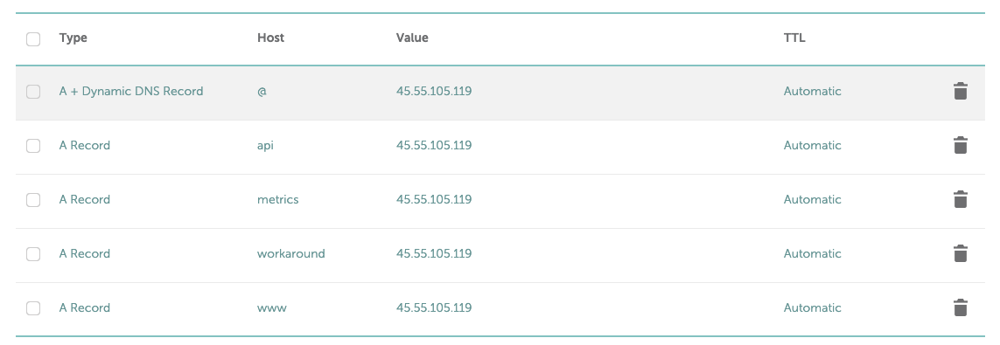

# Deployment via Kubernetes

## Server and local Setup

Make sure you are on a bash-compatible machine like Linux or Mac.

These steps have already been done, but in case they ever have to be redone, here are the steps to set up our Kubernetes cluster from scratch:

1. Set up kubernetes cluster on a cloud provider (Digital Ocean).
2. Configure kubectl CLI tool to point to cloud provider's cluster. Digital Ocean has really easy to follow instructions for using their DO CLI to do this. 
3. Add [nginx-ingress](https://kubernetes.github.io/ingress-nginx/deploy/) for Digital Ocean. I didn't use helm, just the DO apply. 
4. Build and deploy Docker images of api and web using the `./docker-build-push.sh` script.
5. Deploy secrets following instructions in below section, then deploy web and api with `kubectl apply -f bridge-api.yaml` and `kubectl apply -f bridge-web.yaml`
6. Comment out the `tls` block in both ingress services, and the `cert-manager.io/cluster-issuer` line before deploying the ingresses, then deploy api and web ingress with `kubectl apply -f ingress-api`, and `kubectl apply -f ingress-web`.
7. Run `kubectl get services`, and the `ETERNAL-IP` column should be filled for the ingress-controller. This is the load-balance IP and we need to create the following A records pointing to it:
    1. `@` host for bridge.club pointing to bridge-web 
    1. `www` host for www.bridge.club point to bridge-web
    2. `api` host for api.bridge.club pointing to bridge-api
    3. `workaround` host for ingress controller pod to pod communication
    4. `metrics` host for Grafana metrics

You will need to wait some time before these are accessible. Don't proceed with the following steps until they are.

Use the below image to see all the records (IP address of load balancer will be different).



8. Once both can be accessed at their respective domains, you can then setup SSL for the domain with cert-manager. But first run `kubectl apply -f nginx-local-service.yaml` to allow for local cluster communication, needed for cert-manager (at least in Digital Ocean).
9. Following the tutorials on [cert-managers website](https://cert-manager.io/docs/installation/kubernetes/). First install the cert manager and verify it is working with `kubectl get pods --namespace cert-manager`.
10. Try applying [ssl/test-cert-manager.yaml](./ssl/test-cert-manager.yaml) and verify that it worked with `kubectl describe certificate -n cert-manager-test`.
11. If it worked, delete it with `kubectl delete -f ssl/test-cert-manager.yaml`. If not, debug what went wrong.
12. Now we can deploy issuers with: `kubectl create -f ssl/prod-issuer.yaml` and `kubectl create -f ssl/staging-issuer.yaml`
13. Uncomment `tls` and `cert-manager.io/cluster-issuer` in both ingress yaml's. You may want to change the `cert-manager.io/cluster-issuer: ` to `letsencrypt-staging` to test, then if that works it can be changed to prod. 
14. Apply one ingress at a time. You can debug the certificates using the following kubectl gets and then describing the resources that come up. `certificates`, `certificaterequest`, `order`, `challenge` 
15. If all worked well, then you can now access secure `https` domains at ebridge.club.
16. Add loki logging, following [this](https://www.scaleway.com/en/docs/use-loki-to-manage-k8s-application-logs/) tutorial:
```
helm repo add loki https://grafana.github.io/loki/charts
```
```
helm install loki-stack loki/loki-stack \
                               --create-namespace \
                               --namespace loki-stack \
                               --set promtail.enabled=true,loki.persistence.enabled=true,loki.persistence.size=40Gi,config.table_manager.retention_deletes_enabled=true,config.table_manager.retention_period=720h
```

Then

```
helm repo add grafana https://grafana.github.io/helm-charts
```
```
helm install loki-grafana grafana/grafana -f ./grafana-values.yaml --namespace=loki-stack \
                              --set persistence.enabled=true,persistence.type=pvc,persistence.size=10Gi \
```

17. Navigate to `metrics.ebridge.club` and add data source `http://loki-stack.loki-stack:3100`.

## Deploying services

Before deploying, make sure any updated secrets are deployed or updated before deploying containers. See the next section, [Deploying Secrets](#deploying-secrets).

1. Determine version to bump to. There is no formula for this, just use best judgement. What matters most is incrementing versions on each release. See [this article](https://medium.com/fiverr-engineering/major-minor-patch-a5298e2e1798) on determining which version to bump. More often than not, just bump the _patch_ version, e.g. `0.0.1` to `0.0.2`.

2. Create a PR with branch name `release-0.0.2` where 0.0.2 is the with the version tag you are bumping to.

3. Bump top-level [package.json](../package.json)'s `version` prop to new version.
For example
```diff
         "name": "bridge-web",
-        "version": "0.0.1"
+        "version": "0.0.2"
         "docker-registry": "ebonsignori",
```

4. Build bridge-api container and deploy it

Starting from this directory, `bridge-web/deploy`, follow prompts to build and push the docker image for the api project with:

```
./docker-build-push.sh api
```

You can skip version confirmations with `./docker-build-push.sh api confirm`, however this is only recommended for CI/CD and NOT manual deploys.

Repeat the same for web,

```
./docker-build-push.sh web
```

Now we can update our Kubernetes cluster to pull down the new images,

```
kubectl apply -f bridge-api.yaml
```

Then for web,

```
kubectl apply -f bridge-web.yaml
```

## Deploy secrets

You only need to deploy or update secrets if there are changes secrets.

Secrets will be under the name `bridge-api` with the same key as their env var name in corresponding `.env.<server-env>.<app>` file.

E.g. [.env.production.api](./.env.production.api) should contain all secrets for the production api cluster.

View existing secret keys with
`kubectl get secrets`

Get a copy of [.env.production.api](./.env.production.api), add it to this directory, navigate to this directory, then deploy the secrets under the `bridge-api` key with
`kubectl create secret generic bridge-api --from-env-file=.env.production.api`

And do the same for [.env.production.web](./.env.production.web). NOTE: At time of writing there are no web secrets. Check web's [.env.secrets.example](../web/.env.secrets.example) to see if any have been added, and remove this message if they have been.
`kubectl create secret generic bridge-web --from-env-file=.env.production.web`

You can explore base64 encrypted secrets with
`kubectl get secret bridge-api -o jsonpath='{.data}'`

And you can delete secrets with
`kubectl delete secret bridge-api`

## Updating secrets

The above instructions are for the initial deploy of secrets. Further updates to already-deployed secrets can be done with the following command:
```
kubectl create secret generic bridge-api \
    ---from-env-file=.env.production.api --dry-run -o yaml | 
  kubectl apply -f -
```

Note, per [this](https://stackoverflow.com/questions/45879498/how-can-i-update-a-secret-on-kubernetes-when-it-is-generated-from-a-file) SO answer, you could just delete and then recreate secrets before deploying pods since the env vars inside pods are already derived from kubernetes secrets and won't be effected until a redeploy.

This means secrets must be updated *before* deploying services if there are any changes to secrets.

## Deploying when image version tag hasn't been bumped

In development or testing you may want to rebuild an image with the same version tag and deploy it to our cluster. However, kubectl will not detect a new version when applying and will not pull it down.

To force repull an image e.g. `bridge-api`, you can run
```
kubectl rollout restart deployment bridge-api
```

NOTE: This also works if you update secrets without changing an image.

## Ingress Controller

Deploy with:
```
kubectl apply -f ingress-service.yaml
```

Get details with:
`
kubectl describe ingress ingress-service
`
